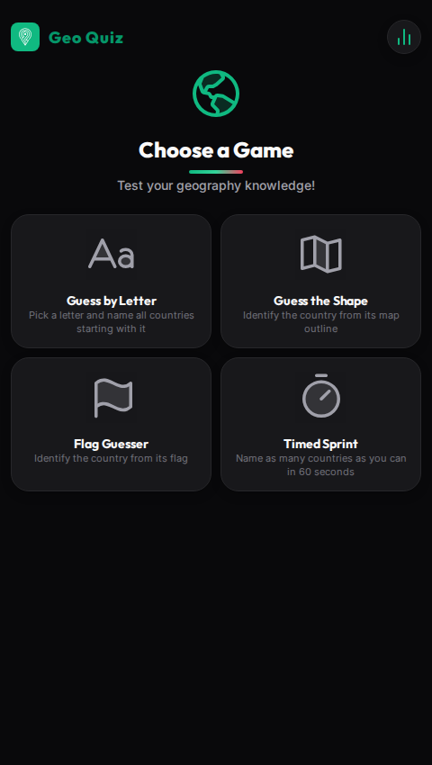

# 🌍 GeoQuiz

[](https://geographquiz.netlify.app)

**Test your geography knowledge with four interactive quiz modes.** Identify countries by letter, recognise their shapes on a map, match flags, and guess capital cities.

> **[👉 Play GeoQuiz](https://geographquiz.netlify.app)**

<p align="center">
  
</p>

---

## ✨ Features

### 🧩 Guess by Letter
Pick a letter (A–Z) and type every country that starts with it. Use up to **two clues** per letter — the first reveals the initial letter of each hidden country, the second reveals an extra random letter. Complete all countries for a letter to mark it done.

### 🗺️ Guess the Shape
See a country's outline rendered on a canvas, then identify it from four multiple-choice options. **Normal mode** shows the target country alongside four nearby neighbours for spatial context. **Hard mode** shows only the target outline. An interactive **3D globe** (draggable with momentum) tracks your overall progress across all 197 countries.

### 🚩 Flag Guesser
A full-screen SVG flag from [flagcdn.com](https://flagcdn.com) with four answer options. Starts with well-known flags (USA, UK, France, Japan, etc.) and gradually introduces harder ones. Filter by continent to focus your practice. Preloads upcoming flags in the background for near-instant display.

### 🏛️ Capitals
Guess the capital city of a given country. Challenge yourself across different continents and track your progress.

### 📊 Statistics & Persistence
All progress is saved automatically to **localStorage** — close the browser and come back to find your streaks, scores, and completed letters exactly where you left off. The stats screen shows:

- Per-game: best streaks, accuracy percentages, rounds played
- **Guess by Letter**: completed/remaining letters grid
- **Flag Guesser**: continent-by-continent progress bars
- **Capitals**: continent-by-continent progress
- **Overall**: accuracy ring chart with correct/total guess counts

### 🎨 Design
- Dark zinc/emerald theme with premium typography (Inter + Outfit)
- Phosphor icons throughout
- Smooth animations: staggered reveals, pop-in transitions, streak pulses, shake on wrong answers
- Fully responsive — works great on mobile and desktop
- No framework overhead — pure vanilla JavaScript

---

## 🛠️ Tech Stack

| Layer     | Technology                                                                 |
| --------- | -------------------------------------------------------------------------- |
| **Build** | [Vite](https://vitejs.dev/) 6.x — fast ES module bundler                   |
| **Runtime** | Vanilla JavaScript (ES modules) — no framework, no dependencies           |
| **Map**   | [D3.js](https://d3js.org/) 7.x — orthographic globe projection + drag      |
| **Map Data** | [TopoJSON](https://github.com/topojson/topojson-client) `world-atlas` — country outlines |
| **Flags** | [flagcdn.com](https://flagcdn.com) — real SVG flags loaded on demand       |
| **Icons** | [Phosphor Icons](https://phosphoricons.com/) — duotone + bold icon set     |
| **Fonts** | [Inter](https://rsms.me/inter/) + [Outfit](https://outfit-font.com/) via Google Fonts |
| **Persistence** | `localStorage` — all progress saved automatically                  |
| **Hosting** | [Netlify](https://www.netlify.com/) — continuous deployment from Git     |

---

## 📁 Project Structure

```
geoquiz/
├── index.html              # Single HTML page — all screens + modals
├── package.json            # Vite + Playwright + topojson-client
├── vite.config.js          # ES2020 target, esbuild minify
├── README.md               # You are here
├── css/
│   └── style.css           # Complete dark theme (~1600 lines)
├── js/
│   ├── main.js             # Entry point: event wiring, routing, preloads
│   ├── state.js            # Central state, screen routing, URL hash
│   ├── utils.js            # $, showToast, normalize, shuffle, escapeAttr
│   ├── persist.js          # localStorage save/load/clear with migration
│   ├── stats.js            # Statistics screen: per-game stats, charts, reset
│   ├── game1.js            # Guess by Letter — picker, clues, submission
│   ├── game2.js            # Guess the Shape — map canvas, options, globe
│   ├── game3.js            # Flag Guesser — flag display, options, phases
│   ├── game4.js            # Timed Sprint — timer, input, results overlay
│   ├── map-renderer.js     # Canvas: country outlines, haversine neighbors
│   ├── globe-progress.js   # D3 orthographic globe with drag + momentum
│   └── data/
│       ├── countries.js    # 197 countries grouped by starting letter
│       ├── continents.js   # Country → continent mapping
│       └── flags.js        # ISO codes, emoji map, TopoJSON name mapping
├── img/
│   ├── logo.png            # App favicon / logo
│   └── game1_logo.jpg      # Optional social preview image
└── dist/                   # Production build output (generated)
```

---

## 🚀 Getting Started

### Prerequisites

- [Node.js](https://nodejs.org/) 18+ and npm (or pnpm / yarn)

### Run Locally

```bash
# Clone the repository
git clone https://github.com/your-username/geoquiz.git
cd geoquiz

# Install dependencies
npm install

# Start the dev server
npm run dev
```

Open the URL shown in the terminal (typically `http://localhost:5173`).

### Production Build

```bash
npm run build
```

The output is in the `dist/` directory, ready to deploy to any static host.

### Preview the Production Build

```bash
npm run preview
```

---

## 🌐 Deployment

This project is deployed on **Netlify**. To deploy your own copy:

1. Push the repository to GitHub (or GitLab / Bitbucket).
2. Log in to [Netlify](https://app.netlify.com/).
3. Click **"Add new site" → "Import an existing project"**.
4. Connect your repository.
5. Netlify auto-detects Vite — the build settings are pre-configured:
   - **Build command**: `npm run build`
   - **Publish directory**: `dist`
6. Click **"Deploy site"**.

The site will be live on a `*.netlify.app` subdomain. You can also add a custom domain in the Netlify dashboard.

---

## 🎮 How to Play

### Home Screen
Four game cards are displayed in a 2×2 grid. Click any card to start. The header logo always returns you home.

### Guess by Letter
1. Pick a letter from the 7×4 grid (progress bars show how many you've found for each letter).
2. Type country names in the search-style input.
3. Use the 💡 clue button if you're stuck (2 per letter).
4. Complete all countries for a letter — it gets marked as done and you move to the next.

### Guess the Shape
1. A country outline appears on the canvas. In Normal mode, 4 faint neighbours provide spatial context.
2. Choose from 4 multiple-choice answers (with flag emoji).
3. Toggle **Hard** mode for a more challenging single-outline view.
4. Skip a round if you're stuck.
5. The globe at the bottom shows your progress — drag to rotate with momentum.

### Flag Guesser
1. A real SVG flag is displayed (loaded from flagcdn.com).
2. Choose the correct country from 4 options.
3. Use the continent filter to focus on specific regions.
4. The game starts with easy, well-known flags and gradually introduces harder ones.

### Capitals
1. A country is presented along with four capital city options.
2. Choose the correct capital.
3. Filter by continent to focus on specific regions.

---

## 📊 Statistics

Click the bar-chart icon in the header to open the statistics screen. It shows:

| Card               | Content                                                    |
| ------------------ | ---------------------------------------------------------- |
| **Guess by Letter** | Completed letters, best streak, accuracy, letter grid      |
| **Guess the Shape** | Best streak, rounds played, accuracy                       |
| **Flag Guesser**    | Best streak, flags identified, accuracy, continent bars    |
| **Capitals**        | Best streak, capitals identified, accuracy, continent bars |
| **Overall Accuracy** | Ring chart combining all quiz games                       |

Use the **"Reset All Data"** button at the bottom to wipe everything (requires confirmation).

---

## 🧠 Architecture Notes

- **Single-page application** — no router library, all routing via URL hashes (`#home`, `#picker`, `#game1`, `#flags`, `#mapgame`, `#capitals`, `#stats`)
- **ES modules** — each game, utility, and data file is a separate module loaded by Vite's dev server or bundled for production
- **State management** — a shared `state` object in `state.js` with per-game data objects that each hold their own `score`, `totalFound`, `allFound` (Set), and `bestStreak`
- **Persistence** — `persist.js` serialises the full game state to `localStorage` with automatic migration from legacy formats
- **Map rendering** — `map-renderer.js` draws TopoJSON country outlines onto a `<canvas>` using a custom mercator-like projection with automatic bounding-box centering
- **Globe** — `globe-progress.js` uses D3's `geoOrthographic` projection with a `d3.drag` handler enhanced with moving-average velocity tracking and exponential-decay momentum for natural-feel spinning
- **Flag preloading** — `game3.js` preloads 35 well-known flags at module init and 8 more opportunistically each round via hidden `Image()` objects

---

## 📄 License

This project is open source and available under the [MIT License](LICENSE).

---

<p align="center">Made with 🌍 and ☕</p>
